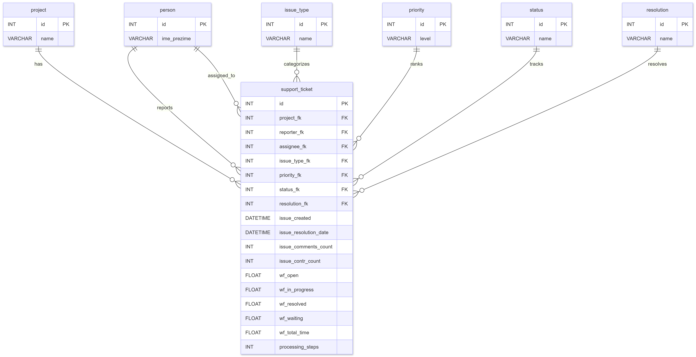
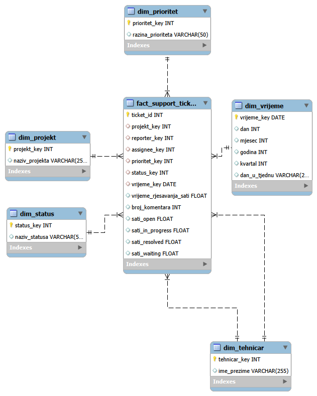

# Analiza helpdesk sustava i optimizacija procesa rješavanja ticketa

## Opis projekta
Ovaj projekt bavi se analizom helpdesk sustava s ciljem razumijevanja učinkovitosti rješavanja korisničkih zahtjeva. Korištenjem stvarnog skupa podataka analiziraju se obrasci u vremenu rješavanja, kompleksnosti zahtjeva i opterećenju sustava.

Projekt obuhvaća cijeli proces izgradnje skladišta podataka – od eksplorativne analize i modeliranja do ETL procesa i vizualizacije podataka.

---

## Cilj projekta
Cilj projekta je:
- analizirati vrijeme rješavanja helpdesk ticketa  
- identificirati uska grla u procesu  
- predložiti poboljšanja za učinkovitiji rad sustava  

---

## Istraživačka pitanja
- Koliko u prosjeku traje rješavanje ticketa?
- Kako kompleksnost (broj koraka) utječe na trajanje?
- Postoje li vremenski obrasci u dolasku ticketa?
- Koji ticketi predstavljaju outliere?
- Kako prioritet i status utječu na vrijeme rješavanja?

---

## Arhitektura rješenja
Projekt je organiziran kroz sljedeće faze:
1. **Eksplorativna analiza podataka (EDA)**  
2. **Relacijski model (OLTP)**  

   
  <em>Slika 1: Relacijski model</em>

3. **Dimenzijski model (Data Warehouse – star schema)**  
4. **ETL proces (transformacija i učitavanje podataka)**  
5. **Vizualizacija i analiza (BI)**  

---

## Grain fact tablice
Jedan zapis u tablici `fact_support_tickets` predstavlja **jedan helpdesk ticket**.

---

## Dimenzijski model

### Dimenzije:
- `dim_projekt` – projekt na kojem je ticket otvoren  
- `dim_tehnicar` – tehničari (reporter i assignee)  
- `dim_prioritet` – razina prioriteta ticketa  
- `dim_status` – status ticketa  
- `dim_vrijeme` – vremenska dimenzija  

   
  <em>Slika 2: Dimenzijski Star model</em>

### Fact tablica:
- `fact_support_tickets` – sadrži metrike i strane ključeve prema dimenzijama  

---

## Surrogate key logika
U dimenzijskom modelu koriste se **surrogate ključevi** (`*_key`) umjesto prirodnih ključeva iz izvornog sustava.

Razlozi:
- stabilnost identifikatora (ne ovise o izvornim podacima)  
- bolja performansa JOIN operacija  
- podrška za historizaciju podataka (SCD)  
- pojednostavljenje ETL procesa  

---

## ETL proces

ETL proces sastoji se od tri faze:

### 1. Extract
- učitavanje izvornog CSV dataset-a (helpdesk ticketi)

### 2. Transform
- čišćenje podataka (null vrijednosti, outlieri)  
- transformacija vremena (sekunde → sati)  
- mapiranje kategorijskih vrijednosti u dimenzije  
- generiranje surrogate ključeva  

### 3. Load
- učitavanje podataka u:
  - dimenzijske tablice  
  - fact tablicu  

---

## Ključni rezultati i uvidi

Analiza je provedena na skupu podataka koji sadrži **66 691 ticket**.

- Prosječno vrijeme rješavanja: **~18.441 sati (~768 dana)**  
- Medijan vremena rješavanja: **~835 sati (~35 dana)**  
- Maksimalno vrijeme rješavanja: **~99.220 sati (~4.134 dana)**  

Velika razlika između prosjeka i medijana ukazuje na postojanje outliera.

- Prosječan broj koraka: **3.23**  
- Maksimalan broj koraka: **57**  

- Outlieri: **~5% ticketa** (iznad 95. percentila)

---

## Poslovna vrijednost
Rezultati omogućuju:
- optimizaciju helpdesk procesa  
- smanjenje vremena rješavanja  
- bolje planiranje resursa  
- identifikaciju uskih grla  

---

## Vizualizacija
Vizualizacije uključuju:
- distribuciju vremena rješavanja  
- trendove kroz vrijeme  
- analizu po prioritetu i statusu  
- identifikaciju outliera  

---

## Zaključak
Analiza pokazuje da većina ticketa ima kratko vrijeme rješavanja, ali mali broj kompleksnih ticketa značajno utječe na ukupne performanse sustava.

Ključni problem predstavljaju ticketi s velikim brojem procesnih koraka, koji uzrokuju povećanje vremena rješavanja i varijabilnost procesa.

Optimizacija sustava trebala bi biti usmjerena na:
- smanjenje kompleksnosti procesa  
- prioritetno rješavanje dugotrajnih ticketa  
- standardizaciju workflow-a  

U budućnosti je moguće razviti prediktivne modele za procjenu vremena rješavanja ticketa.
